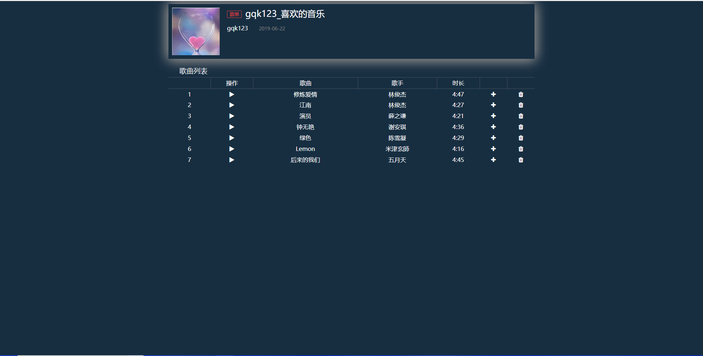

# MusicServer2.0

## 碎碎念

这个项目也是做了挺久的，其实就是在原来的MusicServer上删了一些东西，也加入了一些新的东西。原来那个项目基本是我一个人写的代码（E-R图是别人帮我设计的），而且基本只用了一个星期，所以还是很仓促的，这次的项目做了相当长时间的准备。

这个项目由6个人合作完成，由于老师的要求所以前端没用框架，后端一开始是软导课程的要求用了python+django框架，后来web课要求又改成了jsp+tomcat，所以丢到tomcat的项目目录下就能直接运行。

## 分工情况

由于采用的前后端分离，所以分工基本上按照前后端来。但是由于web课只有后端的智超和我们前端的三人，所以改jsp阶段的后端其实是由我们4人共同完成的。

后端：曾智超、曹文华、陈剑锋。

前端：龚秦康、郭旺振、陈超明。

## 部分运行效果图

主页：

歌单页面：

播放页面：

## 一点感想

本次大项目我们实现了一个音乐播放器，前端我主要负责主页面以及播放页面，后端部分我写了登录、注册、主页面、搜索页面（查询功能）、播放相关的逻辑处理、以及用户验证等，遇到了很多问题也一一解决。

在写前端的时候，主页面没有遇到什么大问题，但在写播放页面的时候，因为要写播放控件的功能，所以花了比较多的时间，播放最核心的功能就是播放、暂停、调节音量、调节进度，最主要的问题集中在调节进度，我实现了两种调节进度的方式：拖拽和点击，点击比较好实现，但拖拽的时候总会遇到当鼠标速度移动过快时导致控件脱离鼠标而使得Mousedown回调失效的问题，最后将拖拽的Mouseup的回调绑定在了window对象上得以解决。在调节进度时遇到的另一个问题是，修改audio对象的currentTime来调节进度，但是发现在chrome上设置currentTime的时候无论设置为什么，都会自动变成0，网上查了许多解决方案都没有解决，似乎是chrome浏览器的问题，在其他浏览器上并未遇到这种情况，而且这个问题也是偶尔会出现，并不是经常性的，所以并未再进行修改。

在写后端部分的时候，许多操作都是数据库相关的，做这些操作之前通常都会用Navicat测试下SQL语句，然后再在代码中运行，所以基本问题都不是很大，唯一比较麻烦的就是设计数据库阶段，本来我们考虑了很多实体集，但最终考虑到时间和进度问题，或者删除或者转化为了现有实体集的属性了。我认为后端的难点其实更多的在于设计阶段，在编码上来说会比前端相对轻松许多。

这次大项目从设计、编码再到测试，三个阶段并不是严格划分的，因为解决了问题后通常可能因为一些疏忽而导致令一些问题的产生，和组员之间的合作也并不是那么顺利，因为总是会存在沟通上的一些不便，有些想法并没有正确的传达，所以项目中不少地方存在着我认为比较冗余的地方，当然在我自己编码的过程中也遇到很多情况下可以避免冗余，但因为会比较花费功夫和时间也都采取了冗余的方案，但也有些地方尽可能地复用代码了，例如一些常用的函数比如用户验证（利用session和cookie）以及在多个页面用到了的搜索函数，都封装在了Util.java里。

总的来说，在这次的大项目中我们小组花了很长时间（大概有两个月），也投入比较多的精力去做，虽然最终的结果也不是特别满意，但还算是可以较好的运行，另外一件比较好的事就是小组里没有划水的队友，每一个人都出了很多力尽量去做好这个项目，也是对我们每一个人一次很好的锻炼。

